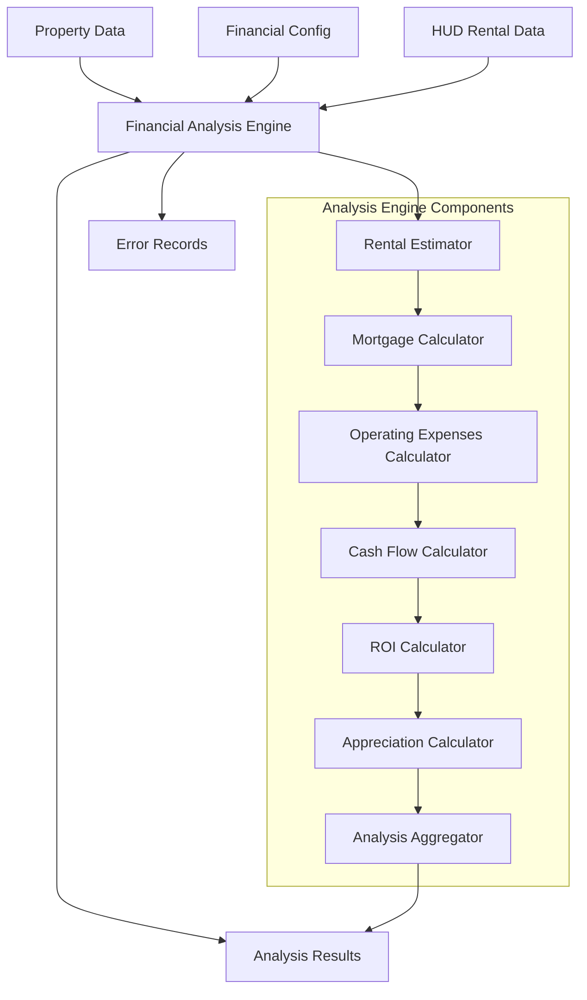
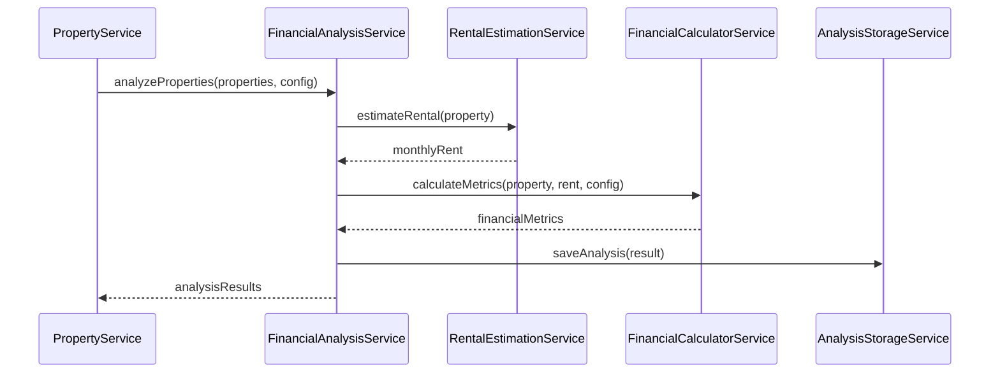

# Financial Analysis Engine Design Document

## Overview

The Financial Analysis Engine is a comprehensive system that calculates real estate investment metrics for properties collected from the Zillow API. The engine integrates with the existing TypeScript architecture, leveraging the established data storage patterns and configuration system. It processes property data through a series of financial calculations to produce detailed analysis resul cash flow, ROI, and long-term appreciation metrics.

The engine follows the existing service-oriented architecture pattern, integrating seamlessly with ent ZillowApiService, DataStorageService, and PropertyService components. It maintains the same error handling, logging, and data validation patterns established in the codebase.

## Architecture

### High-Level Architecture



### Service Integration Pattern

The Financial Analysis Engine follows the established service pattern:

1. **FinancialAnalysisService**: Main orchestrator service
2. **RentalEstimationService**: Handles rental income calculations
3. **FinancialCalculatorService**: Core financial calculations
4. **AnalysisStorageService**: Extends DataStorageService for analysis results
5. **HudDataService**: Manages HUD rental data integration

### Data Flow



## Components and Interfaces

### 1. FinancialAnalysisService

**Purpose**: Main orchestrator for financial analysis operations

**Key Methods**:
```typescript
class FinancialAnalysisService {
  analyzeProperty(property: Property, config: FinancialConfig): Promise<AnalysisResult>
  analyzeProperties(properties: Property[], config: FinancialConfig): Promise<AnalysisResult[]>
  analyzeBatch(zipCodes: string[], config: FinancialConfig): Promise<BatchAnalysisResult>
}
```

**Responsibilities**:
- Coordinate analysis workflow for single or multiple properties
- Handle error cases and data quality validation
- Integrate with rental estimation and financial calculation services
- Store analysis results using AnalysisStorageService

### 2. RentalEstimationService

**Purpose**: Estimate monthly rental income using multiple data sources

**Key Methods**:
```typescript
class RentalEstimationService {
  estimateRental(property: Property, config: FinancialConfig): Promise<RentalEstimate>
  loadHudData(filePath: string): Promise<HudRentalData[]>
  matchHudData(property: Property, hudData: HudRentalData[]): HudRentalData | null
}
```

**Data Source Priority**:
1. HUD rental data (if configured and available)
2. Zillow rentZestimate (if available)
3. Fallback percentage of purchase price

**HUD Data Integration**:
- Load HUD rental data from JSON file
- Match properties by location and characteristics
- Cache HUD data for performance

### 3. FinancialCalculatorService

**Purpose**: Core financial calculations for investment metrics

**Key Methods**:
```typescript
class FinancialCalculatorService {
  calculateMortgagePayment(principal: number, rate: number, years: number): number
  calculateOperatingExpenses(rent: number, price: number, config: OperatingExpensesConfig): OperatingExpenses
  calculateCashFlow(rent: number, mortgage: number, expenses: OperatingExpenses): CashFlowMetrics
  calculateROIMetrics(cashFlow: CashFlowMetrics, investment: number, price: number): ROIMetrics
  calculateAppreciation(price: number, rate: number, years: number): AppreciationMetrics
}
```

**Financial Formulas**:
- **Monthly Mortgage Payment**: PMT = P * [r(1+r)^n] / [(1+r)^n - 1]
- **Cash-on-Cash Return**: Annual Cash Flow / Total Cash Invested
- **Cap Rate**: Annual NOI / Purchase Price
- **Gross Rent Multiplier**: Purchase Price / Annual Rent
- **DSCR**: NOI / Annual Debt Service

### 4. AnalysisStorageService

**Purpose**: Extend DataStorageService for analysis-specific storage

**Key Methods**:
```typescript
class AnalysisStorageService extends DataStorageService {
  saveAnalysisResults(zipCode: string, results: AnalysisResult[]): void
  loadAnalysisResults(zipCode: string, date?: string): AnalysisResult[] | null
  saveAnalysisSummary(summary: AnalysisSummary): void
  exportAnalysisToCSV(zipCodes: string[], dateRange?: DateRange): string
}
```

**Storage Structure**:
```
data/
├── analysis/
│   ├── {zipCode}/
│   │   ├── {date}/
│   │   │   ├── analysis-results.json
│   │   │   └── analysis-summary.json
```

### 5. HudDataService

**Purpose**: Manage HUD rental data integration

**Key Methods**:
```typescript
class HudDataService {
  loadHudData(filePath: string): Promise<HudRentalData[]>
  matchPropertyToHudData(property: Property, hudData: HudRentalData[]): HudMatch | null
  validateHudData(data: any[]): HudRentalData[]
}
```

## Data Models

### Extended Analysis Result Schema

Building on the existing `AnalysisResultSchema`, add detailed breakdown:

```typescript
export const DetailedAnalysisResultSchema = AnalysisResultSchema.extend({
  financialMetrics: z.object({
    // Existing fields...
    monthlyRent: z.number(),
    monthlyMortgagePayment: z.number(),
    monthlyOperatingExpenses: z.nu    monthlyCashFlow: z.number(),
    
    // Enhanced breakdown
    operatingExpensesBreakdown: z.object({
      propertyManagement: z.number(),
      maintenance: z.number(),
      vacancy: z.number(),
      insurance: z.number(),
      propertyTax: z.number(),
      hoaFees: z.number(),
      utilitie(),
      other: z.number()
    }),
    
    // Additional metrics
    netOperatingIncome: z.number(),
    totalCashRequired: z.number(),
    monthlyPrincipalPayment: z.number(),
    monthlyInterestPayment: z.number(),
    
    // Long-term projections
    projectedValue: z.number(),
    totalCashFlowProjected: z.number(),
    totalReturnProjected: z.number(),
    annual: z.number()
  }),
  
  rentalEstimate: z.object({
    source: z.enum(['HUD', 'ZILLOW', 'FALLBACK']),
    confidence: z.enum(['HIGH', 'MEDIUM', 'LOW']),
    monthlyRent: z.number(),
    hudMatch: z.object({
      matched: z.boolean(),
      hudRent: z.number().optional(),
      matchCriteria: z.string().optional()
    }).optional()
  })
});
```

### HUD Rental Data Schema

```typescript
export const HudRDataSchema = z.object({
  zipCode: z.string(),
  bedrooms: z.number(),
  fairMarketRent: z.number(),
  year: z.number(),
  county: z.string(),
  state: z.string(),
  propertyType: z.string().optional()
});

export type HudRentalData = z.infer<typeof HudRentalDat>;
```

### Batch Analysis Result Schema

```typescript
export const BatchAnalysisResultSchema = z.object({
  timestamp: z.string(),
  zipCodes: z.array(z.string()),
  totalProperties: z.number(),
  successfulAnalyses: z.number(),
  failedAnalyses: z.number(),
  results: z.array(DetailedAnalysisResultSchema),
  errors: z.array(ErrorRecordSchema),
  summary: z.object({
    averageCashFlow: z.number(),
    averageROI: z.number(),
    averageCapRate: z.number(),
    topPerformers: z.array(z.string()), // Property IDs
    dataQualityScore: z.number()
  })
});
```

## Error Handling

### Error Categories

1. **Data Quality Errors**: Missing or invalid property data
2. **Configuration Errors**: Invalid financial configuration
3. **Calculation Errors**: Mathematical calculation failures
4. **Storage Errors**: File system or data persistence issues
5. **HUD Data Errors**: HUD data loading or matching failures

### Error Handling Strategy

```typescript
class AnalysisError extends Error {
  constructor(
    public type: 'DATA_QUALITY' | 'CONFIGURATION' | 'CALCULATION' | 'STORAGE' | 'HUD_DATA',
    public propertyId: string | null,
    message: string,
    public details?: any
  ) {
    super(message);
  }
}
```

### Graceful Degradation

- **Missing Rental Data**: Use fallback percentage calculation
- **Invalid Property Data**: Skip property and log error
- **HUD Data Unavailable**: Fall back to Zillow estimates
- **Calculation Failures**: Return partial results with error flags

## Testing Strategy

### Unit Testing

1. **Financial Calculations**: Test all mathematical formulas with known inputs/outputs
2. **Rental Estimation**: Test HUD data matching and fallback logic
3. **Data Validation**: Test schema validation and error handling
4. **Configuration Loading**: Test financial configuration parsing

### Integration Testing

1. **End-to-End Analysis**: Test complete property analysis workflow
2. **Batch Processing**: Test multiple property analysis
3. **Storage Integration**: Test analysis result persistence
4. **Error Scenarios**: Test handling of various error conditions

### Test Data

- **Sample Properties**: Create test properties with various data completeness levels
- **Mock HUD Data**: Create sample HUD rental data for testing
- **Financial Scenarios**: Test edge cases (negative cash flow, high appreciation, etc.)

### Performance Testing

- **Batch Analysis**: Test performance with large property datasets
- **Memory Usage**: Monitor memory consumption during batch processing
- **Calculation Speed**: Benchmark financial calculation performance

## Implementation Phases

### Phase 1: Core Financial Calculations
- Implement FinancialCalculatorService with all mathematical formulas
- Create comprehensive unit tests for calculations
- Validate against known real estate scenarios

### Phase 2: Rental Estimation System
- Implement RentalEstimationService with HUD data integration
- Create HUD data loading and matching logic
- Implement fallback rental estimation methods

### Phase 3: Analysis Orchestration
- Implement FinancialAnalysisService as main coordinator
- Integrate rental estimation with financial calculations
- Implement error handling and data quality validation

### Phase 4: Storage and Batch Processing
- Extend DataStorageService for analysis results
- Implement batch processing capabilities
- Create analysis summary and reporting features

### Phase 5: API Integration
- Create REST API endpoints for analysis operations
- Integrate with existing PropertyService
- Implement CSV export functionality

## Performance Considerations

### Optimization Strategies

1. **Calculation Caching**: Cache expensive calculations for reuse
2. **HUD Data Indexing**: Create efficient lookup structures for HUD data
3. **Batch Processing**: Process multiple properties efficiently
4. **Memory Management**: Stream large datasets to avoid memory issues

### Scalability

- **Modular Design**: Each service can be scaled independently
- **Async Processing**: Use async/await for non-blocking operations
- **Error Isolation**: Failures in one property don't affect others
- **Configuration Flexibility**: Support different analysis scenarios

## Security Considerations

### Data Protection

- **Input Validation**: Validate all inputs using Zod schemas
- **File System Security**: Secure file operations and path validation
- **Configuration Security**: Validate financial configuration parameters
- **Error Information**: Avoid exposing sensitive data in error messages

### Access Control

- **API Security**: Implement proper authentication for analysis endpoints
- **File Access**: Restrict access to analysis data files
- **Configuration Access**: Secure financial configuration data

## Monitoring and Logging

### Analysis Metrics

- **Processing Time**: Track analysis duration per property
- **Success Rate**: Monitor analysis success/failure rates
- **Data Quality**: Track data completeness and quality scores
- **Error Patterns**: Identify common error scenarios

### Logging Strategy

```typescript
interface AnalysisLog {
  timestamp: string;
  operation: string;
  propertyId?: string;
  zipCode?: string;
  duration: number;
  success: boolean;
  errorType?: string;
  dataQuality?: number;
}
```

### Performance Monitoring

- **Memory Usage**: Monitor memory consumption during batch processing
- **CPU Usage**: Track computational load during analysis
- **Storage Growth**: Monitor analysis data storage growth
- **API Response Times**: Track analysis endpoint performance